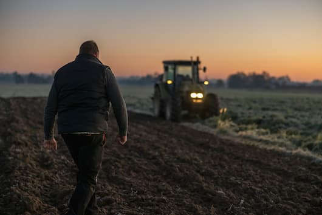

# Sowing Success: ML for Crop Selection

Identifying which single soil metric (Nitrogen, Phosphorus, Potassium, or pH) is the most important for predicting the ideal crop — useful for farmers with a limited budget for soil testing.

## Context

Measuring every soil indicator is expensive. If a farmer can only afford to measure **one metric**, which one alone best predicts the ideal crop for the field?

## Dataset

- `soil_measures.csv`: Nitrogen (N), Phosphorus (P), Potassium (K), pH, and the ideal crop (`crop`, the target variable with **22 crop types**, 100 samples each — a balanced dataset)

## Methodology

- A **multinomial Logistic Regression** model was trained **separately for each feature** (N, P, K, pH), isolating each one's individual predictive power
- Evaluated using **weighted F1-score** on a held-out test set (80/20 split)

## Key Findings

| Feature | F1-score |
|---|---|
| Nitrogen (N) | 0.0915 |
| Phosphorus (P) | 0.1476 |
| **Potassium (K)** | **0.2390** |
| pH | 0.0453 |

- **Potassium (K)** is the single best predictor of the ideal crop on its own
- Worth noting: even the best individual feature has a fairly low F1 (0.24) — no single metric is a strong standalone predictor; combining all of them is needed for a truly accurate model

## Tech Stack

`pandas` · `scikit-learn` (`LogisticRegression`, `f1_score`)
